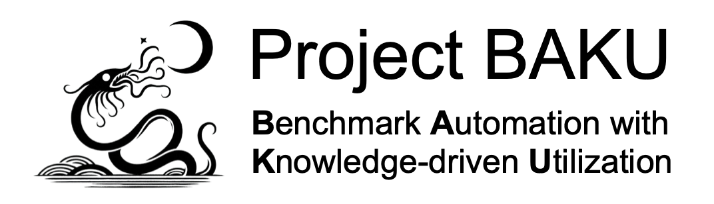

<p align="center">
  </br>
</p>


## Goals
The goal of this project is to train and fine-tune large language models to generate benchmarks to stress-test computing systems such as compilers, operating systems and memory allocation systems.

## Installing & Setup

### 1. Clone Baku:
```cmd
  git clone https://github.com/lac-dcc/baku.git
```
### 2. Run python requirements
On the root folder, run the command:
```cmd
  pip install -r requirements.txt
```

### 3. Code & notebooks
You can run all the scripts normal envs. But, the notebooks have very heavy Deep-Learning models, because of this, the actual experiments are setup to run in colab and generate files only on drive (but the code generation is okay for any GPU env).